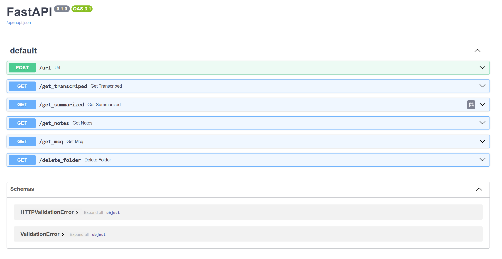
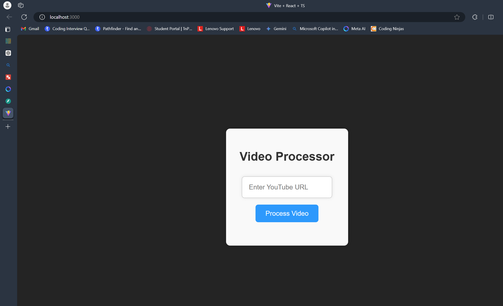
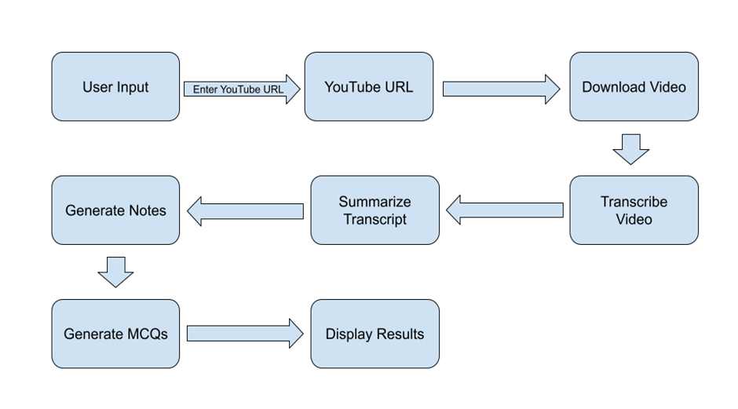
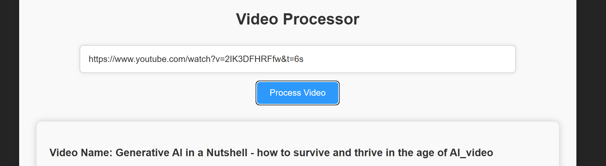
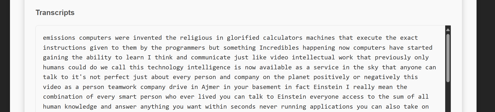
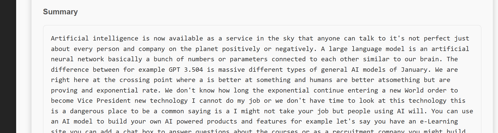
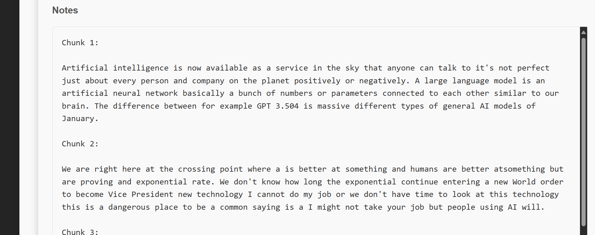
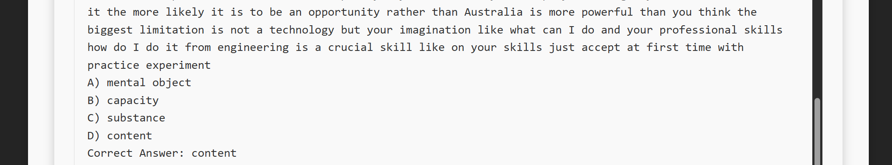
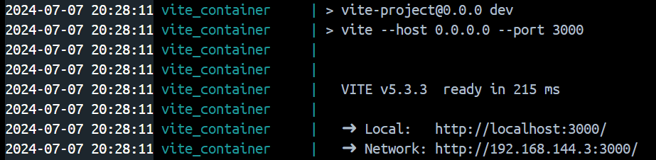
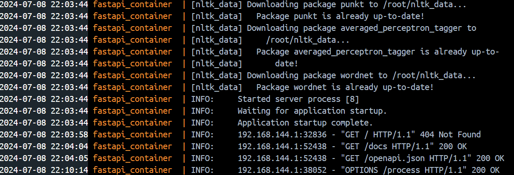

# Project Documentation: Learning assistant; video transcriber; summarizer; mcq generator; notes generator

## Overview

This project is an automated video processing system designed to:

1. Download YouTube videos.
2. Transcribe their audio.
3. Summarize the transcriptions.
4. Generate notes.
5. Create multiple-choice questions (MCQs).

The system leverages various Python libraries and frameworks and is built with a FastAPI backend and a React frontend, orchestrated using Docker.

## Project Structure

### Backend (`server/`)

The backend handles video processing and provides RESTful API endpoints to interact with the frontend.

- **main.py**: The main FastAPI application.
- **Dockerfile**: Docker configuration for the FastAPI backend.
- **requirements.txt**: Python dependencies for the backend.
- **component/**:
  - `Youtube_reader/youtube_reader2.py`: YouTube video downloader.
  - `Video_Transcriber2/video_transcriber.py`: Video transcriber.
  - `Summarizer2/summarize.py`: Text summarizer.
  - `Note_Generator2/note_gen.py`: Note generator.
  - `Mcq_Generator2/mcq_gen.py`: MCQ generator.



### Frontend (`frontend/`)

The frontend is a React application that allows users to input a YouTube URL and view the processed files.

- **src/VideoProcessor.tsx**: React component for video processing.
- **Dockerfile**: Docker configuration for the React frontend.
- **package.json**: Node.js dependencies for the frontend.



### Docker Configuration

- **docker-compose.yml**: Docker Compose configuration to set up both backend and frontend services.

## Methodology

### Architecture

The system follows a microservices architecture, with distinct components for each processing step. Each component is responsible for a specific task, promoting separation of concerns and scalability.

### Backend Workflow

1. **Download Video**: Uses `pytube` to download the video and `requests` with `BeautifulSoup` to fetch video details.
2. **Transcribe Video**: Uses `moviepy` to extract audio and `speech_recognition` to transcribe it.
3. **Summarize Transcript**: Uses the `transformers` library with the BART model to summarize the text.
4. **Generate Notes**: Summarizes the text in smaller chunks using the BART model.
5. **Generate MCQs**: Uses NLTK to create MCQs from the transcript text.

### Frontend Workflow

1. **User Input**: Users enter a YouTube URL.
2. **Trigger Processing**: The URL is sent to the backend via a POST request.
3. **Display Results**: The frontend fetches and displays the processed files (transcript, summary, notes, and MCQs).



## Detailed Explanation of Components

### YouTubeDownloader

This component downloads YouTube videos and extracts video details.

```python
class YouTubeDownloader:
    def __init__(self):
        self.download_path = './downloads'
        os.makedirs(self.download_path, exist_ok=True)

    def get_video_details(self, video_url):
        response = requests.get(video_url)
        soup = BeautifulSoup(response.content, 'html.parser')
        # Extract details like title, description, views, likes, etc.
        # ...

    def download_video_and_audio(self, video_url):
        yt = YouTube(video_url)
        video_stream = yt.streams.filter(progressive=True, file_extension='mp4').order_by('resolution').desc().first()
        video_path = video_stream.download(output_path=self.download_path)
        return video_path
```



The `YouTubeDownloader` class allows users to fetch video details, download videos from YouTube, and
convert the downloaded video's audio to MP3 format.

### VideoTranscriber

This component extracts audio from videos and transcribes it.

```python
class VideoTranscriber:
    def __init__(self):
        self.download_path = './downloads/split_audio'
        self.transcript_path = './transcripts'
        os.makedirs(self.download_path, exist_ok=True)
        os.makedirs(self.transcript_path, exist_ok=True)

    def extract_audio(self, video_path):
        video = VideoFileClip(video_path)
        audio_path = os.path.join(self.download_path, os.path.splitext(os.path.basename(video_path))[0] + '.wav')
        video.audio.write_audiofile(audio_path, codec='pcm_s16le')
        return audio_path

    def transcribe_audio(self, audio_path):
        recognizer = sr.Recognizer()
        with sr.AudioFile(audio_path) as source:
            audio_data = recognizer.record(source)
            text = recognizer.recognize_google(audio_data)
        return text
```



The `VideoTranscriber` class provides methods to extract audio from a video, transcribe the audio
using Google Speech Recognition, save the transcription as text and CSV files, split the audio into
chunks, and transcribe the video in chunks for better accuracy.

### TextSummarizer

This component summarizes the transcriptions using a transformer model.

```python
class TextSummarizer:
    def __init__(self, model_name='facebook/bart-large-cnn', chunk_size=512, summary_length=150):
        self.summarizer = pipeline('summarization', model=model_name)
        self.chunk_size = chunk_size
        self.summary_length = summary_length

    def summarize_text(self, text):
        summary = self.summarizer(text, max_length=self.summary_length, min_length=int(self.summary_length / 2), do_sample=False)
        return summary[0]['summary_text']
```



The TextSummarizer class in Python uses the transformers library to summarize text files and save
the summaries as both text and CSV files.

### NoteGenerator

This component generates notes by summarizing the text in smaller chunks.

```python
class NoteGenerator:
    def __init__(self, model_name='facebook/bart-large-cnn', chunk_size=512, note_length=150):
        self.summarizer = pipeline('summarization', model=model_name)
        self.chunk_size = chunk_size
        self.note_length = note_length

    def generate_notes(self, text):
        notes = self.summarizer(text, max_length=self.note_length, min_length=int(self.note_length / 2), do_sample=False)
        return notes[0]['summary_text']
```



The `NoteGenerator` class in Python uses the Hugging Face Transformers library to generate
summarized notes from a text file, splitting the text into chunks and saving the notes in both text
and CSV formats.

### MCQGenerator

This component generates MCQs from the text using NLP techniques.

```python
class MCQGenerator:
    def __init__(self, file_path):
        self.file_path = file_path
        self.text = self.read_text_file(file_path)
        self.mcqs = []

    def get_synonyms(self, word):
        synonyms = set()
        for syn in wordnet.synsets(word):
            for lemma in syn.lemmas():
                synonym = lemma.name().replace('_', ' ')
                if synonym.lower() != word.lower():
                    synonyms.add(synonym)
        return list(synonyms)

    def generate_mcqs(self):
        sentences = sent_tokenize(self.text)
        for sentence in sentences:
            words = word_tokenize(sentence)
            words_pos = nltk.pos_tag(words)
            nouns = [word for word, pos in words_pos if pos in ['NN', 'NNS', 'NNP', 'NNPS']]
            if nouns:
                correct_answer = random.choice(nouns)
                question_text = sentence.replace(correct_answer, "______")
                synonyms = self.get_synonyms(correct_answer)
                if synonyms and len(synonyms) >= 3:
                    distractors = random.sample(synonyms, 3)
                    options = [correct_answer] + distractors
                    random.shuffle(options)
                    self.mcqs.append([question_text] + options + [correct_answer])
```



The `MCQGenerator` class reads text from a file, generates multiple-choice questions (MCQs) based on
nouns in the text, finds synonyms for the correct answers, and saves the generated MCQs to both a
CSV file and a text file.

### React Frontend

The React frontend allows users to input a YouTube URL and view the processed files.

#### `VideoProcessor.tsx`

This component handles user input, triggers the backend processing, and displays the results.

```tsx
import React, { useState } from "react";
import axios from "axios";
import "./VideoProcessor.css";

const VideoProcessor: React.FC = () => {
  const [url, setUrl] = useState("");
  const [response, setResponse] = useState(null);
  const [error, setError] = useState("");

  const handleProcess = async () => {
    try {
      const res = await axios.post("http://localhost:8000/process", {
        url_P: url,
      });
      setResponse(res.data);
      setError("");
    } catch (err) {
      setError("An error occurred during processing.");
    }
  };

  return (
    <div className="container">
      <h1>Video Processor</h1>
      <input
        type="text"
        value={url}
        onChange={(e) => setUrl(e.target.value)}
        placeholder="Enter YouTube URL"
      />
      <button onClick={handleProcess}>Process Video</button>
      {error && <p className="error">{error}</p>}
      {response && <div>{JSON.stringify(response)}</div>}
    </div>
  );
};

export default VideoProcessor;
```

- The `VideoProcessor` component in TypeScript React fetches video processing results and associated
- file contents based on a provided YouTube URL.
- @returns The `VideoProcessor` component is being returned. This component is a functional component
- in React that processes a video from a given YouTube URL. It allows the user to input a YouTube URL,
- processes the video using an API endpoint, and displays the generated files such as transcripts,
- summary, notes, and MCQs in a structured format on the UI. The component handles user input, API
- requests,

### Docker Configuration

#### Backend Dockerfile

```Dockerfile
FROM python:3.10-slim

WORKDIR /usr/app

COPY . /usr/app/

RUN pip install fastapi uvicorn -r /usr/app/requirements.txt

EXPOSE 8000

CMD ["uvicorn", "main:app", "--host", "0.0.0.0", "--port", "8000", "--reload"]
```



The above code is a Dockerfile that sets up a Python environment for running a FastAPI application.

#### Frontend Dockerfile

```Dockerfile
FROM node:18

WORKDIR /app

COPY package.json .

RUN npm install

COPY . .

EXPOSE 3000

CMD ["npm", "run", "dev", "--", "--host", "0.0.0.0", "--port", "3000"]
```



The above code is a Dockerfile used to build a Node.js application container.

#### Docker Compose

```yaml
services:
  frontend:
    build: ./
    container_name: vite_container
    expose:
      - 3000
    ports:
      - "3000:3000"
    volumes:
      - /app/node_modules
      - ./:/app
    depends_on:
      - backend_service

  backend_service:
    build: ./server
    container_name: fastapi_container
    expose:
      - 8000
    ports:
      - "8000:8000"
    volumes:
      - /usr/app/__pycache__
      - ./server:/usr/app
```

The above code is a configuration file written in YAML format for defining services using Docker

### Running the Project

1. **Backend**: Navigate to the `server` directory and build the Docker image.
   ```sh
   docker build -t fastapi-backend .
   docker run -p 8000:8000 fastapi-backend
   ```
2. **Frontend**: Navigate to the `frontend` directory and build the Docker image.
   ```sh
   docker build -t react-frontend .
   docker run -p 3000:3000 react-frontend
   ```
3. **Using Docker Compose**: From the root directory, run:
   ```sh
   docker-compose up --build
   ```

### Key Points and Best Practices

1. **Separation of Concerns**: Each component (downloader, transcriber, summarizer, note generator, MCQ generator) has a single responsibility, making the codebase more modular and maintainable.
2. **Error Handling**: Comprehensive error handling is implemented to ensure the system's robustness.
3. **Scalability**: The microservices architecture allows individual components to be scaled independently.
4. **Asynchronous Processing**: The FastAPI backend is designed to handle asynchronous processing, improving performance and responsiveness.
5. **User Experience**: The React frontend provides a simple and intuitive interface for users to interact with the system.

This setup provides a fully automated workflow for processing YouTube videos, from downloading and transcribing to summarizing and generating educational content.
